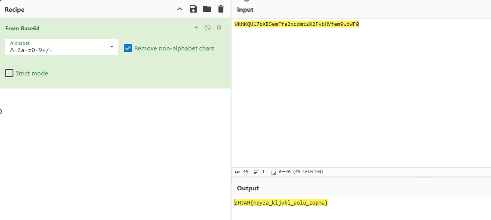
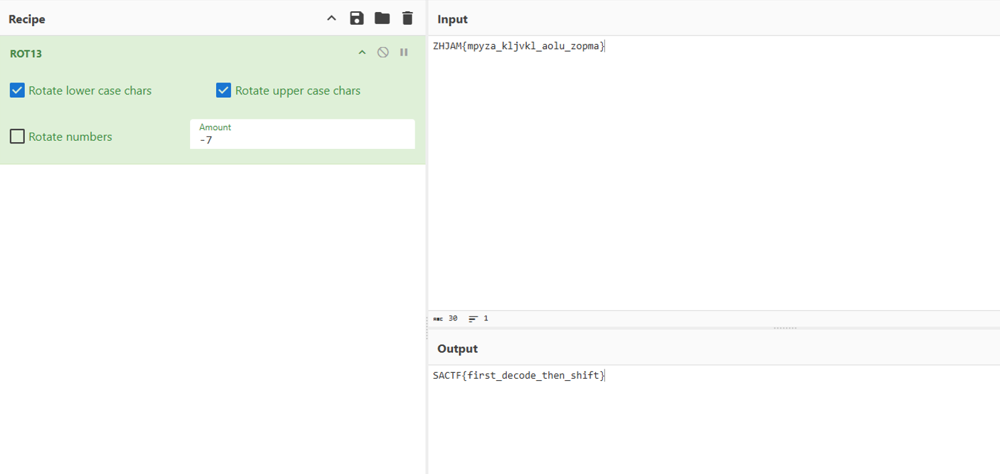

# [CRYPTO] Hidden in Plain Sight

## Description

We intercepted a message that looks harmless at first glance. Everything seems readable… but something is still off. Take a closer look and see if you can uncover what’s really hidden inside.

`WkhKQU17bXB5emFfa2xqdmtsX2FvbHVfem9wbWF9`

## Solution

The string appears to be encoded in `base64`. Let's try to decode it.

I will use the Cyberchef tool https://gchq.github.io/CyberChef/

The output we recieve is:

`ZHJAM{mpyza_kljvkl_aolu_zopma}`

But we know that the correct flag format must to be `SACTF{...}` so our work is not done yet.

The format seems correct but the letters dont match the requirements, so probably there are a second level of encryption.

The key point is that there are no strange symbols or characters, the letters simply dont make sense. 

This is tipical of a `Caesar encoding`

To decode this string we need to know the shifting pattern. To figure it out, let's compare the first part of the string with the expected result.

| Encoded | Expected | Shift |
| ------- | ------ | ---------- |
| Z       | S      | −7         |
| H       | A      | −7         |
| J       | C      | −7         |
| A       | T      | −7         |
| M       | F      | −7         |

We now know that the shift pattern is `-7`

So let's return to Cyberchef.
Load the `ROT13` recipe and set the shifting Amount to -7

