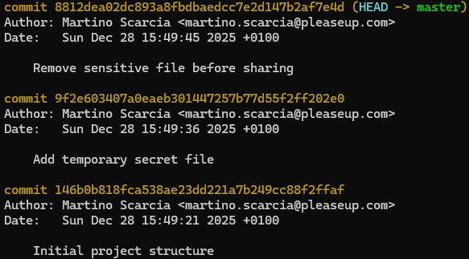

# [FORENSICS] Git Gone Wrong

# Description

This repository was shared as part of a final review. At first glance, everything looks normal and ready to be released.

Take a closer look and see if there is more than what appears on the surface.

# Solution

Download and extract the .zip file. The content of the folder appear like this.

```
Mode                 LastWriteTime         Length Name
----                 -------------         ------ ----
d-----        02/02/2026     11:29                .git
-a----        17/01/2026     16:48             56 notes.txt
-a----        17/01/2026     16:48             19 README.md
-a----        17/01/2026     16:48           2703 rr_generator.py
```

Let's check for more information about the git file

with the `git log` we can display the full commit history


