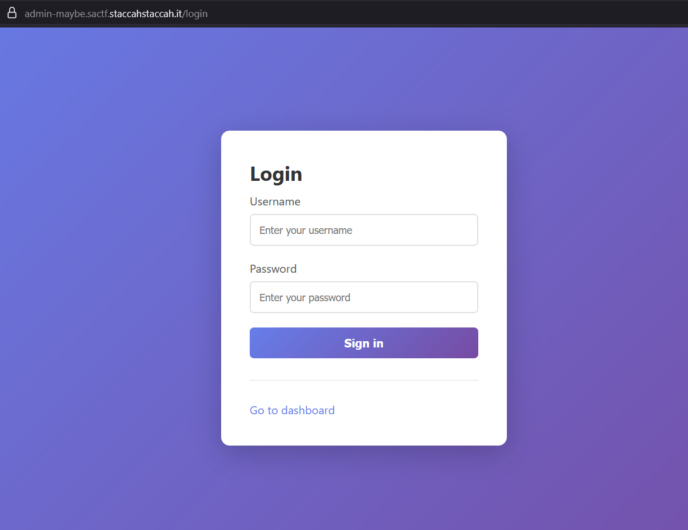
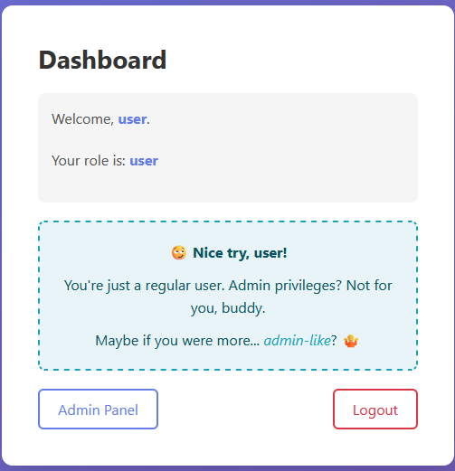
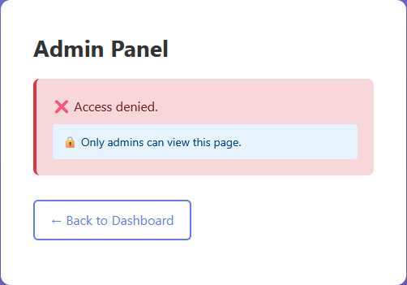
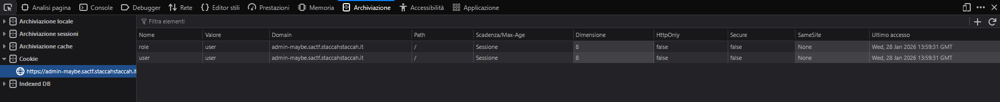
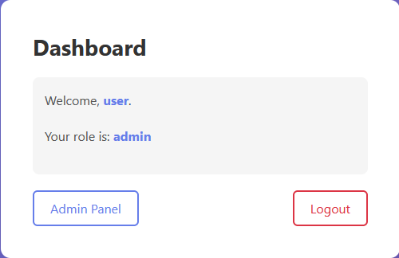
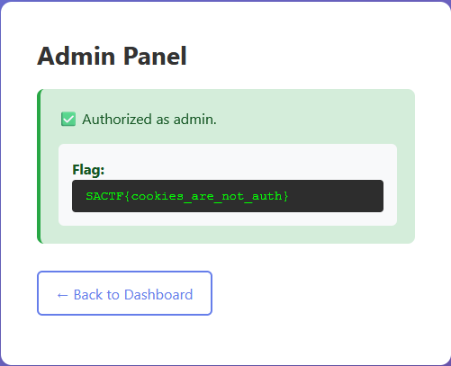

# [WEB] Admin? Maybe

## Description

An internal dashboard was shared for review. The admin panel exists, but access control feels oddly implemented. Can you reach the admin area?

You can access the application at: https://admin-maybe.sactf.staccahstaccah.it

`Username: user`

`Password: SecureP@ss2026!`

## Solution

The site appears like this

We can use the provided credential to login

But of course we log in as a normal user

And clearly the access to Admin Panel is denied to us.

Try to crack the login page appear very costly and difficult with just the provided information.

But the prompted hint of the Dashboard

`
You're just a regular user. Admin privileges? Not for you, buddy. Maybe if you were more... admin-like?
`

give me an idea: 
what if user can be changed as Admin role?

Previously we logged in as a normal user. Let's check what the site knows about us and wht remember.

We check the Cookie and we can see that the site remember the `user: user` as `role: user`

But if we manipulate the `role` value we can make the site think that user is an Admin

After change it we can see the updated Role in the dashboard

And as Admin we are authorized to access the Admin Panel

